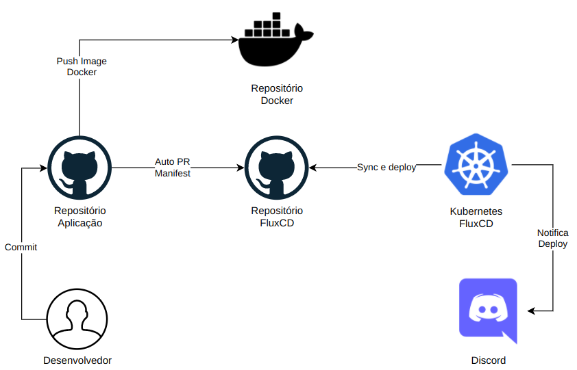

## Pipeline GitOps com [FluxCD](https://fluxcd.io/)

### Objetivo:
Irá auxiliar na implantação, atualização das aplicações no cluster kubernetes de forma automatizada.

### O que é GitOps?
A ideia central do GitOps é que exista uma “fonte da verdade” um repositório git que contém arquivos declarativos da infraestrutura (arquivos declarativos são os manifestos yaml que serão utilizados no deploy da aplicação no cluster). E um processo automatizado que irá garantir que tudo que está no git estará em execução no cluster Kubernetes.

### O que é o Flux?
O Flux é uma solução de entrega contínua e progressiva para Kubernete, ele mantém o cluster Kubernete em sincronia com a fonte da verdade (repositórios Git) e automatiza as implantações e atualizações.
#### Conceitos fundamentais:
- **Fonte da verdade:** É um repositório contendo o estado desejado da nossa aplicação. As alterações são verificadas em um intervalo de tempo definido, se houver uma versão mais recente um novo artefato será reproduzido. 
- **Reconciliação:** garante o estado desejado definido declarativamente na fonte da verdade. 
- **Bootstrap:** O processo de instalação dos componentes do Flux.

### Infraestrutura:


### Detalhes do pipeline:
1. O desenvolvedor commita as mudanças no repositório da aplicação.
2. Github Actions irá buildar a imagem da aplicação e envia para repo docker, utilizaremos os 8 caracteres do hash do commit. 
3. Ainda no repositório da aplicação serão colhidas algumas variáveis de ambiente para preencher os manifestos que serão utilizados no k8s. 
4. Após o preenchimento dos manifestos o mesmo passará por uma validação usaremos kubeval.
5. Após a validação do manifesto será aberto um PR automaticamente no repositório do FluxCD.
6. Após as aprovações do PR e feito o merge fluxcd identifica as mudanças e faz o deploy no cluster.

## Demonstração
Implantar Flux no cluster k8s.

### Pré-Requisitos:
- [Cluster k8s](https://minikube.sigs.k8s.io/docs/start/)
- [Flux CLI](https://fluxcd.io/docs/installation/#install-the-flux-cli)
- [Discord Server](https://support.discord.com/hc/pt-br/articles/204849977-Como-Criar-um-Servidor-)

### Bootstrap FluxCD:
Esse procedimento irá implantar Flux no cluster, criará um repositório **flux-k8s** e configura as chaves ssh pública no repositório flux-k8s. 
```shell
$ export GITHUB_TOKEN=<your-token>
$ export GITHUB_USER=<your-username>

$ flux bootstrap github \
--owner=$GITHUB_USER \
--repository=$GITHUB_USER/flux-k8s \
--branch=main \
--path=clusters/production \
--interval=1m \
--log-level=info \
--namespace=flux \
--personal
```
Para conferir digite: `kubectl get all -n flux`

### Criar webhook discord:
Para este procedimento vamos precisar da URL do webhook do Discord Server:
> Para criar um webhook do discord server siga este artigo do [Discord](https://support.discord.com/hc/pt-br/articles/228383668-Usando-Webhooks): 

Criar secret webhook discord:
```shell
$ kubectl -n flux-system create secret generic discord-url \ 
--from-literal=address=https://discord.com/api/webhooks/WEBHOOK/DO_SEU/DISCORD_SERVER
```

### Notificação:
Precisamos criar um provedor de notificação para o Discord fazendo referência as secrets acima. 
1. Clone o repositório que foi criado na implantação do Flux:
2. Crie um diretório para nossas aplicações dentro desse diretório vamos manter os manifestos.

```shell
$ git clone https://github.com/$GITHUB_USER/flux-k8s.git
$ cd flux-k8s/clusters/production
$ mkdir apps
```
3. Criar manifesto `provider.yaml` para provedor de notificação. Antes vamos criar um diretório para o app de notificação.

```shell
$ cd apps
$ mkdir notification
$ cd notification
```
> Agora podemos criar o manifesto use o seguinte conteúdo. Não esqueça de alterar o canal.

```yaml
---
apiVersion: notification.toolkit.fluxcd.io/v1beta1
kind: Provider
metadata:
  name: naw-provider
  namespace: flux
spec:
  channel: SEU-CANAL-DISCORD-SERVER
  secretRef:
    name: discord-url
  type: discord
  username: flux-bot
```

4. Criar manifesto `alert.yaml` define os alertas para repositório git: utilize o conteúdo a seguir.

```yaml
---
apiVersion: notification.toolkit.fluxcd.io/v1beta1
kind: Alert
metadata:
  name: naw-alert
  namespace: flux
spec:
  eventSeverity: info
  eventSources:
  - kind: Kustomization
    name: '*'
  - kind: GitRepository
    name: '*'
  providerRef:
    name: naw-provider
```

5. Não vamos implantar os manifestos manualmente o Flux fará isso pra gente. Vamos empurrar as alterações para repositório git.

```shell
$ git add .
$ git commit -m "feat: add recurso de notificacao discord"
$ git push
```

> Aguarde alguns segundos o Flux fará implantaçao dos manifestos no cluster.

Para conferir as alterações digite:
```shell
$ kubectl get providers -n flux
$ kubectl get alerts -n flux
```
### Testando notificação:
Vamos utilizar um manifesto do nginx como exemplo.
1. Dentro do diretório **production/apps** do repositório do **flux-k8s** crie um diretório **nginx**.

```shell
$ mkdir nginx
```

2. Crie o manifesto `deployment.yaml` com o seguinte conteúdo:
```yaml
apiVersion: apps/v1
kind: Deployment
metadata:
  name: nginx-flux-test
  namespace: default
  labels:
    app: nginx
spec:
  replicas: 1
  selector:
    matchLabels:
      app: nginx
  template:
    metadata:
      labels:
        app: nginx  
    spec:
      containers:
      - name: nginx-flux-test
        image: nginx
        imagePullPolicy: IfNotPresent
        ports:
        - containerPort: 80
```
> Não vamos implantar o manifesto manualmente o Flux fará isso pra gente. rsrsrsrsrs

3. Faça o commit das alterações do repositório:

```shell
$ git add .
$ git commit -m "feat: add recurso ngix"
$ git push
```
> Aguarde alguns segundos você receberá uma notificação no Discord.

Para conferir se app foi implantado no cluster utilize o comando: `kubectl get pods`

A saída será algo como:
```shell
NAME                              READY   STATUS    RESTARTS      AGE
nginx-flux-test-6b759fdd4-hdbfh   1/1     Running   1 (13h ago)   15h
```